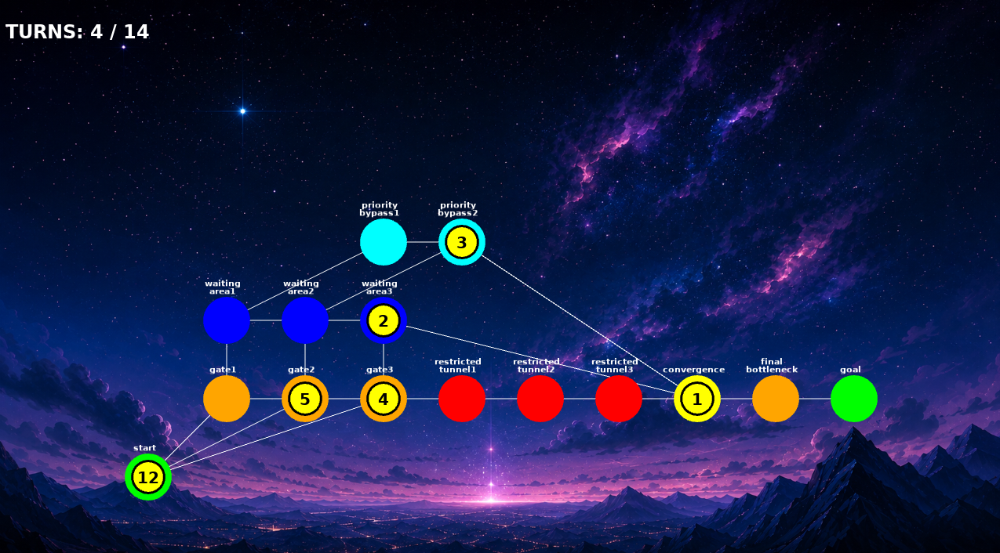

# *This project has been created as part of the 42 curriculum by blidriss.*

# Fly-in

## Description

Fly-in is a drone traffic simulation that models the movement of multiple drones through a network of interconnected hubs. The project focuses on path planning, congestion management, and turn-based simulation while respecting the capacity constraints of hubs and connections.

The map is described in a text file and parsed into a graph where:

* **Zones (hubs)** represent locations drones can occupy.
* **Connections** represent the routes between zones.
* Each zone and connection has its own capacity constraints.
* Restricted zones require additional turns to traverse.

The program computes valid paths for every drone, schedules their movements while avoiding capacity conflicts, and generates a turn-by-turn simulation.

To help visualize the execution, the project also includes a graphical interface built with the Arcade library. The visualization animates drone movements, displays the graph structure, and allows the user to replay the simulation.

---

## Features

* Parse and validate custom map files.
* Graph-based map representation.
* Shortest-path computation using Dijkstra's algorithm.
* Multi-path generation with yen algorithm for drone routing.
* Capacity management for hubs and connections.
* Support for restricted zones.
* Display visualization using the Arcade library.
* Colorized terminal simulation output using Rich.

---

## Project Structure

```text
.
├── maps/              # Simulation maps
├── erros.py           # Errors Types
├── parser.py          # Map parser and validation
├── simulation.py      # Drone scheduler and simulation logic
├── Graph.py           # Core graph data structures
└── display.py         # Arcade Visualisation
├── main.py            # Program entry point
└── README.md
```

---

## Instructions

### Requirements

* Python 3.10+
* Rich
* arcade

### Installation

Clone the repository:

```bash
git clone <repository-url>
cd fly-in
```

Install the required packages and Create the virtual environment::

```bash
make install
```

---

### Running the project

Run the simulation with with default map:

```bash
make run
```
Or use a one of provided maps in "maps/" dir

Example:

```bash
make run MAP=maps/hard/02_capacity_hell.txt
```

---

## Algorithm Explanation

The project uses **Dijkstra's algorithm** to compute the shortest path for each drone. Zone costs are used as edge weights, allowing restricted zones to be penalized and avoided when possible.

To reduce congestion, the simulator generates multiple alternative routes using a variation of **Yen's K-Shortest Paths algorithm**. This provides several valid paths instead of forcing every drone to follow the same route.

Drone movement is executed in **turns**. Before moving, each drone checks the capacity of both the destination hub and the connecting route. If either is full, the drone waits until the next turn. This scheduling ensures that all movements respect the network's capacity constraints and prevents collisions.

---

## Map and Output Format

A map defines:

* Number of drones
* Start hub
* End hub
* Intermediate hubs
* Connections between hubs
* Optional hub attributes (metadata) such as color or maximum drone capacity

Example:

```text
# Easy Level 1: Simple linear path
nb_drones: 2

start_hub: start 0 0 [color=green]
hub: waypoint1 1 0 [color=blue]
hub: waypoint2 2 0 [color=blue]
end_hub: goal 3 0 [color=red]

connection: start-waypoint1
connection: waypoint1-waypoint2
connection: waypoint2-goal
```

Terminal Output Example:

```text
Turn1: D1-waypoint1 
Turn2: D1-waypoint2 D2-waypoint1 
Turn3: D1-goal D2-waypoint2 
Turn4: D2-goal 

Simulation Done withen 4 Turn .
```

Arcade Visualistion Example:


---

## Simulation

Each turn, every drone attempts to move toward its destination while respecting:

* Hub capacities
* Connection capacities
* Restricted-zone traversal rules

The simulator records every movement and produces a replay that can be printed to the terminal

---

## Visualization

The Arcade viewer displays:

* The graph structure
* Drone animations
* Turn progression
* Drone identifiers
* Replay controls

The visualization is independent of the simulation logic and uses the generated replay data to animate drone movement.


---

## Technical Choices

* **Dijkstra's algorithm** is used for shortest-path computation.
* Multiple candidate paths are generated to reduce congestion.
* The simulation is executed turn by turn to guarantee deterministic behavior.
* Arcade is used to provide a lightweight real-time visualization of the simulation.

---

## Resources
https://youtu.be/4jyESQDrpls?si=ctn2zo-m0NpUi5VD

https://youtu.be/bZkzH5x0SKU?si=1iY0rzNBSpKvep1Z

https://neo4j.com/docs/graph-data-science/current/algorithms/yens/

https://api.arcade.academy/en/3.3.3/#

### AI Usage
* Explaining algorithms and Python concepts.
* Discussing implementation ideas and architectural choices.
